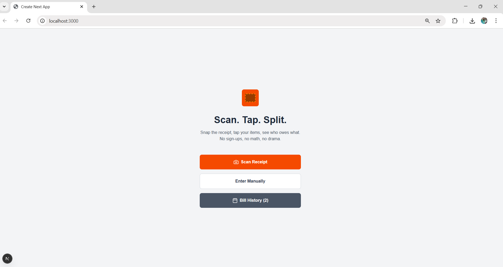
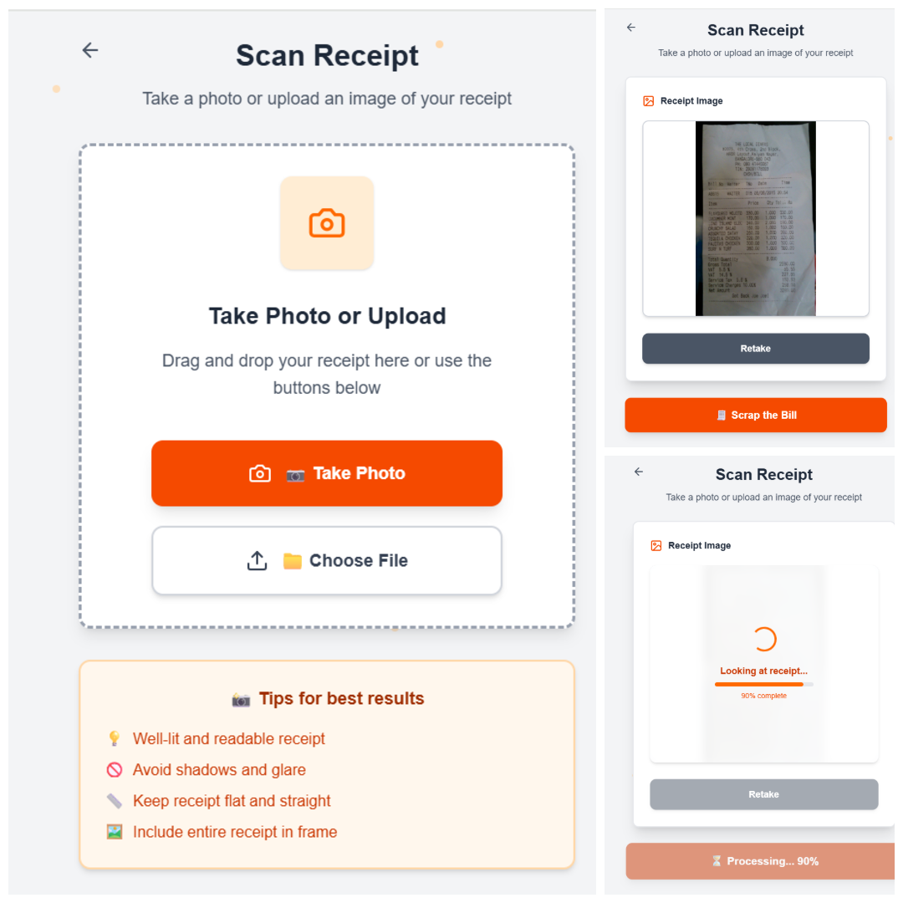
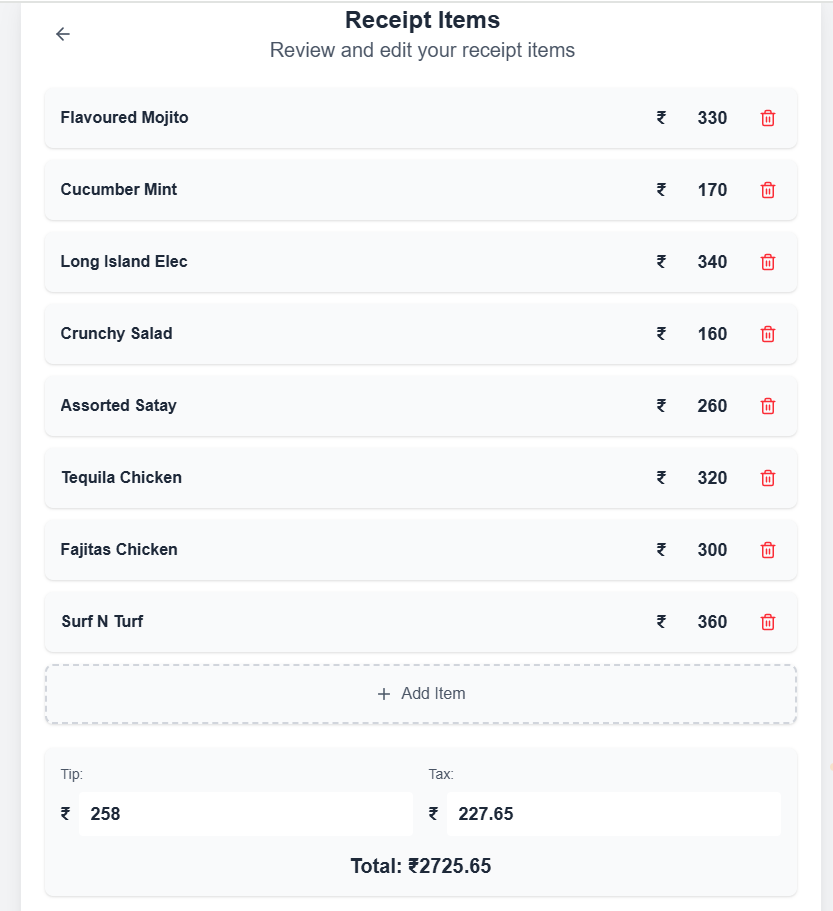
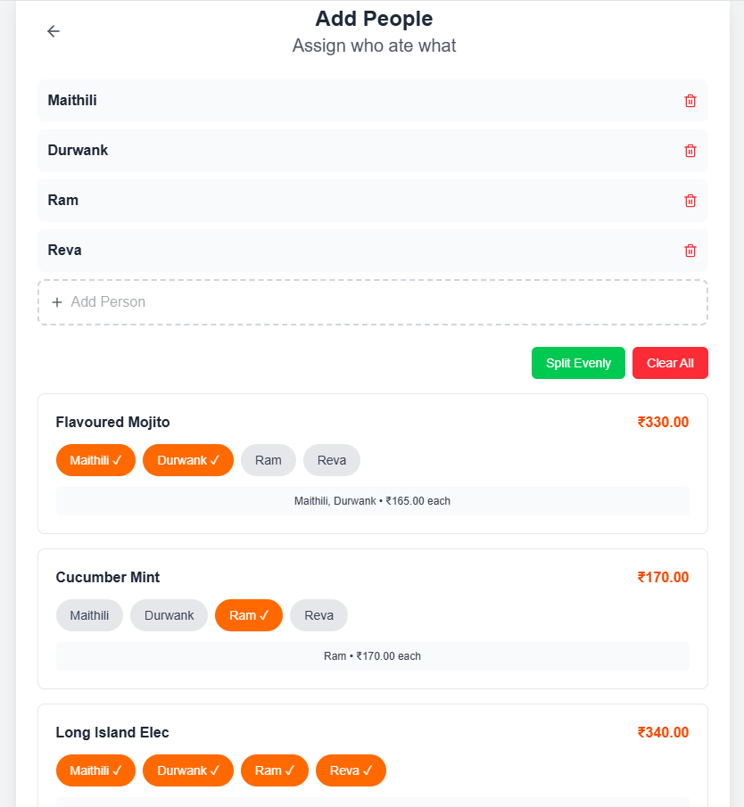
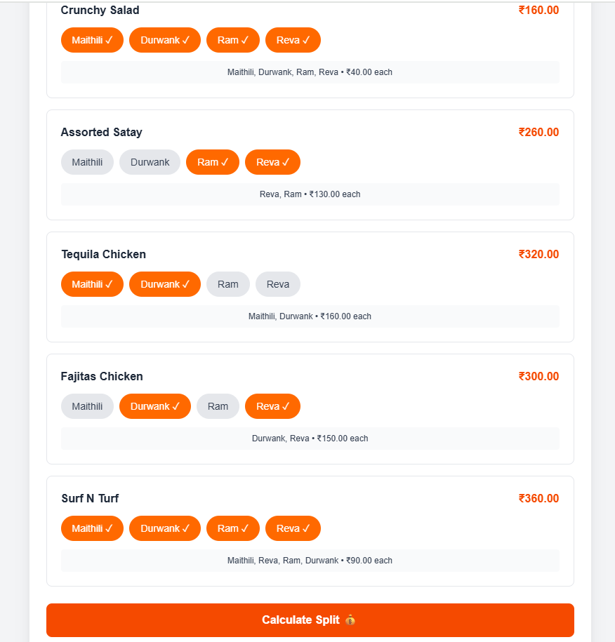
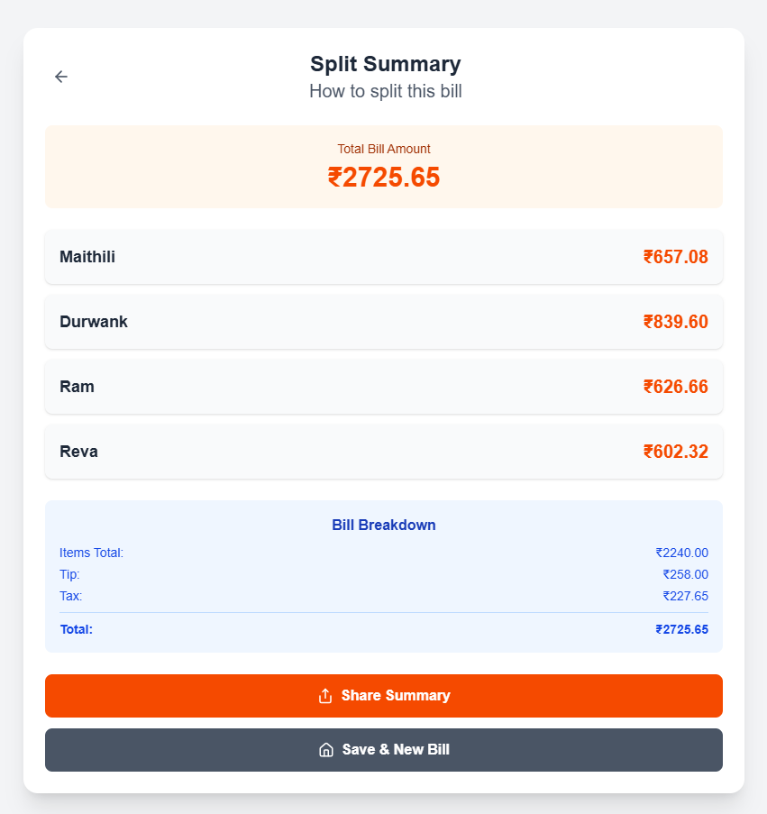
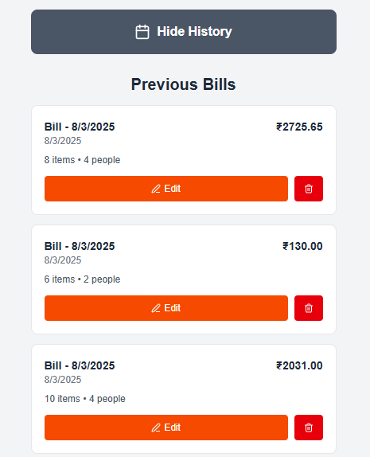

# 🧾 Bill Splitter App

A modern, AI-powered bill splitting application built with Next.js 14, TypeScript, and Google's Gemini Vision API. Simply scan your receipt and automatically split the bill among friends!


## 🚀 Live Demo

[**Try the Live App →**](https://bill-splitter-ai.vercel.app) 

## ✨ Features

- 📸 **Smart Receipt Scanning** - Take a photo or upload receipt images
- 🤖 **AI-Powered Analysis** - Google Gemini Vision API automatically extracts items, prices, tax, and tip
- 👥 **Easy People Management** - Add friends and assign items with a simple interface
- 💰 **Automatic Calculations** - Real-time bill splitting with tax and tip distribution
- 📱 **Mobile-First Design** - Responsive UI that works perfectly on all devices
- 🎨 **Beautiful UI** - Modern design with smooth animations and transitions
- 💾 **State Management** - Persistent data using Zustand store
- 📊 **Bill History** - Track and revisit all your previous bill splits
- 🆓 **Completely Free** - No subscriptions or hidden costs

# 📱 App Screenshots

## 🖼️ Complete User Journey - Grid View

<div align="center">

<table>
<tr>
<td align="center" width="50%">

### 🏠 Home Page


**🚀 Start Your Journey**
- Clean, welcoming interface
- Quick access to all features
- Animated background dots
- Mobile-first design

</td>
<td align="center" width="50%">

### 📸 Receipt Scanner

**🤖 AI-Powered Scanning**
- Camera or file upload
- Drag & drop support
- Real-time progress tracking
- Google Gemini Vision API

</td>
</tr>
<tr>
<td align="center">

### 📋 Items Management


**✏️ Review & Edit Items**
- Auto-extracted from receipt
- Add/edit/remove items
- Adjust tax and tip
- Clean item cards

</td>
<td align="center">

### 👥 People Management


**👫 Add Your Friends**
- Simple person management
- Colorful emoji avatars
- Easy add/remove interface
- Visual feedback

</td>
</tr>
<tr>
<td align="center">

### 🎯 Item Assignment


**🎲 Who Had What?**
- Tap to assign items
- Multi-person sharing
- Visual assignment feedback
- Real-time calculations

</td>
<td align="center">

### 💰 Final Bill Split


**🎉 Everyone's Share**
- Detailed per-person breakdown
- Tax and tip included
- Share/copy amounts
- Professional layout

</td>
</tr>
<tr>
<td align="center" colspan="3">

### 📊 Bill History


**📈 Track Your Splits**
- View all previous bill splits
- Quick access to past receipts
- Date-wise organization
- Total spending insights
- Easy sharing and reference
- Search and filter options

</td>
</tr>
</table>

</div>

## 🛠️ Tech Stack

- **Frontend**: Next.js 14, React 18, TypeScript
- **Styling**: Tailwind CSS
- **State Management**: Zustand
- **AI/ML**: Google Gemini Vision API
- **Icons**: Lucide React
- **Deployment**: Vercel (recommended)

## 📦 Installation

### Prerequisites

- Node.js 18+ 
- npm or yarn
- Google Gemini API key (free)

### Step 1: Clone the Repository

```bash
git clone https://github.com/yourusername/bill-splitter-app.git
cd bill-splitter-app
```

### Step 2: Install Dependencies

```bash
npm install
# or
yarn install
```

### Step 3: Environment Setup

Create a `.env.local` file in the root directory:

```env
NEXT_PUBLIC_GEMINI_API_KEY=your_gemini_api_key_here
```

### Step 4: Get Google Gemini API Key

1. Visit [Google AI Studio](https://makersuite.google.com/app/apikey)
2. Click "Create API Key"
3. Copy the generated API key
4. Paste it in your `.env.local` file

### Step 5: Run the Development Server

```bash
npm run dev
# or
yarn dev
```

Open [http://localhost:3000](http://localhost:3000) to view the app.

## 🎯 How to Use

### 1. 📸 Scan Your Receipt
- Take a photo or upload an image of your receipt
- The AI will automatically analyze and extract all items

### 2. ✏️ Review & Edit Items
- Check the extracted items and prices
- Add, edit, or remove items as needed
- Adjust tax and tip amounts

### 3. 👥 Add People
- Add friends who shared the meal
- Assign items to specific people
- Items can be shared among multiple people

### 4. 💰 Get the Split
- View everyone's total automatically calculated
- See breakdown of items, tax, and tip per person
- Share the results with your friends

## 🏗️ Project Structure

```
bill-splitter-app/
├── src/
│   ├── app/
│   │   ├── page.tsx              # Home page
│   │   ├── scan/
│   │   │   └── page.tsx          # Receipt scanning
│   │   ├── items/
│   │   │   └── page.tsx          # Items management
│   │   ├── people/
│   │   │   └── page.tsx          # People management
│   │   ├── split/
│   │   │   └── page.tsx          # Final bill split
│   │   ├── history/
│   │   │   └── page.tsx          # Bill history
│   │   ├── layout.tsx            # Root layout
│   │   └── globals.css           # Global styles
│   ├── components/               # Reusable components
│   ├── store/
│   │   └── useSplitStore.ts      # Zustand store
│   └── types/                    # TypeScript types
├── public/                       # Static assets
├── screenshots/                  # App screenshots for README
├── .env.local                    # Environment variables 
├── .gitignore                    # Git ignore rules
├── tailwind.config.js            # Tailwind configuration
├── next.config.js                # Next.js configuration
├── tsconfig.json                 # TypeScript configuration
├── package.json                  # Dependencies and scripts
└── README.md                     # Project documentation
```

## 🔧 Configuration

### Tailwind CSS

The app uses a custom Tailwind configuration with:
- Custom colors (orange theme)
- Extended animations
- Custom utilities for better UX

### Environment Variables

| Variable | Description | Required |
|----------|-------------|----------|
| `NEXT_PUBLIC_GEMINI_API_KEY` | Google Gemini Vision API key | Yes |

## 🤖 AI Integration

### Google Gemini Vision API

The app uses Google's Gemini 1.5 Flash model for:
- **Receipt Text Recognition** - Extracting text from images
- **Context Understanding** - Identifying items vs. headers/footers  
- **Price Extraction** - Finding exact prices for each item
- **Tax & Tip Detection** - Automatically calculating additional charges

### API Usage
- **Free Tier**: 15 requests per minute (900 per hour)
- **Rate Limits**: Automatically handled with progress indicators
- **Error Handling**: Graceful fallbacks and user feedback

## 📱 Mobile Optimization

- **Camera Integration** - Direct camera access on mobile devices
- **Touch-Friendly** - Large buttons and touch targets
- **Responsive Design** - Works on all screen sizes
- **Performance** - Optimized for mobile networks

## 🚀 Deployment

### Deploy to Vercel 

1. Push your code to GitHub
2. Connect your repository to [Vercel](https://vercel.com)
3. Add your environment variables in Vercel dashboard
4. Deploy automatically

### Other Platforms

The app can be deployed to any platform that supports Next.js:
- AWS Amplify
- Heroku
- DigitalOcean App Platform

## 🔒 Privacy & Security

- **No Data Storage** - All data stays in your browser
- **Secure API Calls** - Environment variables protect API keys
- **Image Processing** - Images are only sent to Google AI for analysis
- **No Personal Info** - No user accounts or personal data collection


### Development Guidelines

- Follow TypeScript best practices
- Use Tailwind CSS for styling
- Write descriptive commit messages
- Test on mobile devices
- Update documentation

## 🐛 Known Issues

- **Camera Permission** - Some browsers may require HTTPS for camera access
- **Large Images** - Very large images may take longer to process
- **API Limits** - Free tier has rate limits (15 requests/minute)


## 💖 Acknowledgments

- **Google AI** - For the amazing Gemini Vision API
- **Vercel** - For the excellent Next.js framework
- **Tailwind CSS** - For the utility-first CSS framework
- **Lucide** - For the beautiful icons

---

<div align="center">

**Made with ❤️ and AI for fair bill splitting**

⭐ **Star this repo if it helped you learn!** ⭐

[🚀 Live Demo](https://bill-splitter-ai.vercel.app)

</div>